<p align="center">
	<a href="https://www.scmintu.com"></a>
</p>
<p align="center">
	<strong>适合互联网企业使用的开源职业体检管理系统</strong>
</p>
<p align="center">
	👉 <a href="https://www.scmintu.com/">https://www.scmintu.com/</a> 👈
</p>

<p align="center">
	<a target="_blank" href="https://spring.io/projects/spring-boot">
		
	</a>
    <a target="_blank" href="https://www.oracle.com/java/technologies/javase/javase-jdk8-downloads.html">
		
	</a>
	<a target="_blank" href="http://www.gnu.org/licenses/lgpl.html">
		
	</a>
</p>


-------------------------------------------------------------------------------

## 📚 项目介绍

healthyCheck是一套适合互联网企业使用的开源体检管理系统，可直接用于健康体检、职业体检、从业体检，适合个体检中心使用，可以对接医院各个设备、LIS、PACS、HIS系统便于数据录入以及出具体检报告，本项目为后端代码工程。

healthyCheck使用`Spring Boot`和`iView Vue`开发，集成`Spring Security`实现权限管理功能，是一套非常实用的web开发框架。

前端工程项目代码：https://gitee.com/scmt1/healthyCheck-ui


## 🍎 项目特点

* 对接了省上职业病体检管理系统，方便网报
* 可以对接各个医疗设备，便于数据录入以及报告整理
* 使用`spring boot`框架作为后端框架，便于维护
* 接口请求和响应数据采用签名机制，保证交易安全可靠
* 管理平台操作界面简洁、易用
* 使用`spring security`实现权限管理
* 前后端分离架构，方便二次开发

## 🍟 项目体验
- 健康体检管理系统：[https://tj.scmintu.com:9123](https://tj.scmintu.com:9123 "健康体检管理系统体验")（体检账号请加QQ群536624215联系管理员）

## 🥞 系统架构

> 健康体检管理系统架构图

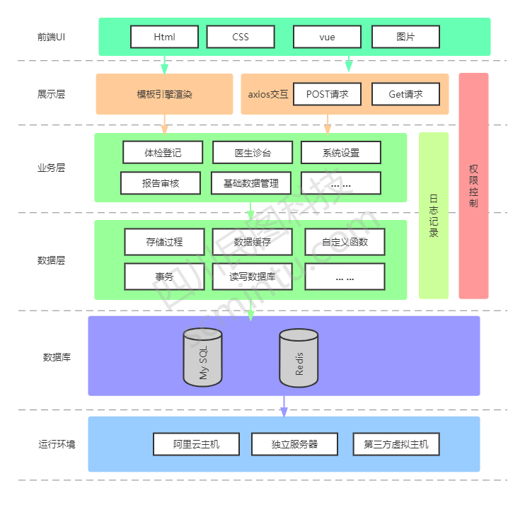
> 健康体检管理系统流程图

 


> 核心技术栈

| 软件名称  | 描述 | 版本
|---|---|---
|Jdk | Java环境 | 1.8
|Spring Boot | 开发框架 | 2.4.5
|Redis | 分布式缓存 | 3.2.8 或 高版本
|MySQL | 数据库 | 5.7.X 或 8.0 高版本
|[Iview Ui](http://iview.talkingdata.com/) | iview Vue框架，前端开发使用 | 4.7.0
|[MyBatis-Plus](https://mp.baomidou.com/) | MyBatis增强工具 | 3.4.2
|[Hutool](https://www.hutool.cn/) | Java工具类库 | 5.6.6

> 项目结构

```lua
healthyCheck-ui  -- https://gitee.com/scmt1/healthyCheck-ui.git
healthy-check-app  -- https://gitee.com/scmt1/healthy-check-app.git

healthyCheck
├── scmt-admin -- 公共配置 启动项目包
└── scmt-core -- 公共工具包
├── scmt-modules -- 核心依赖包
     ├── scmt-activiti -- activiti组件
     └── scmt-base -- 父组件
     ├── scmt-generatori -- 代码生成组件
     └── scmt-license -- 授权组件     
     ├── scmt-yw -- 业务代码组件
└── vx_images -- 项目截图
```

##  版本更新
- v1.0
项目初始化，完成业务页面功能（包括：基础数据（体检项目、套餐等）、用户管理、角色管理、菜单管理、体检单位、体检订单、体检人员、体检审核、体检登记、体检台账、分诊台、医生问诊、医生总检、报告打印、单位报告、数据网报等）
- v2.0
1、修复已知bug（个人报告里医生签名未显示的问题以及项目结果不全的问题、单位报告里检查项目重复的问题、体检信息录入时抓取对接设备数据不全的问题以及添加等）
2、调整总检页面（完全重写总检页面（拆分总检页面功能以及对接省平台接口所需数据调整的页面功能）
3、添加App端（添加微信小程序端，主要实现了用户在手机端预约体检的功能：体检机构选择=》体检类型选择=》人员信息录入=》体检套餐选择=》体检预约记录查看）

## 🍿 功能模块

> 健康体检管理系统功能
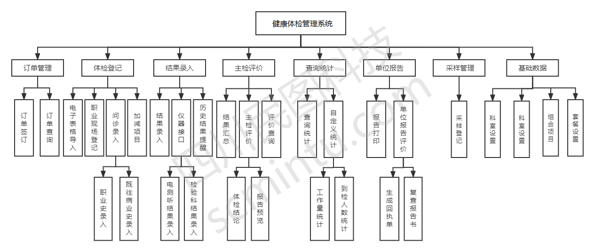

## 🍯 系统截图

`以下截图是从实际已完成功能界面截取,截图时间为：2022-07-06 08:59`
### 医生pc端
1、系统登录
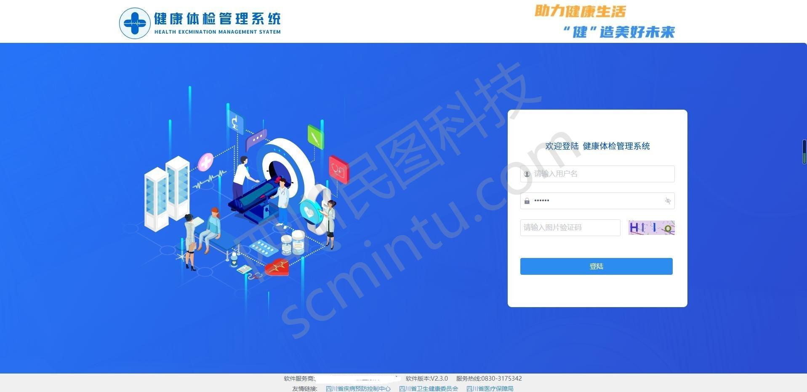
2、订单创建

3、信息录入
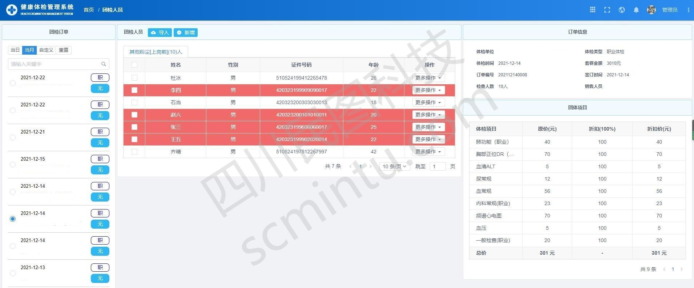

4、体检登记
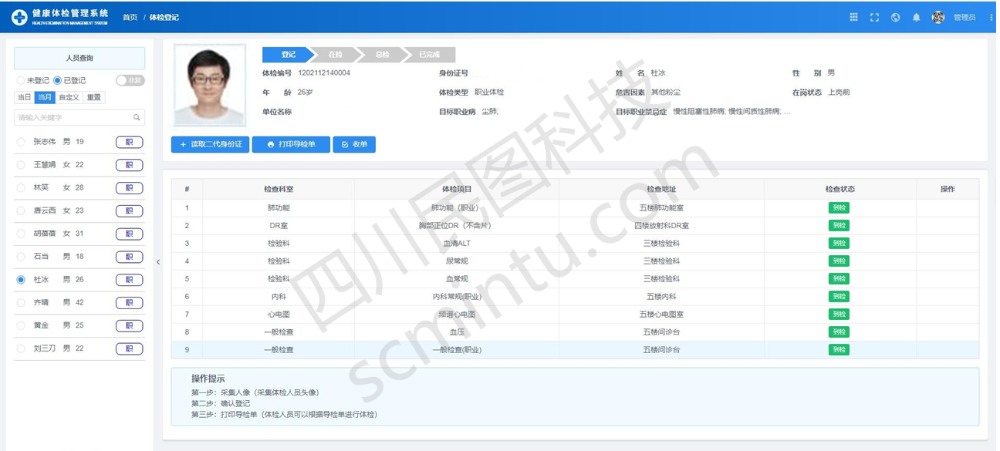
5、体检引导单打印

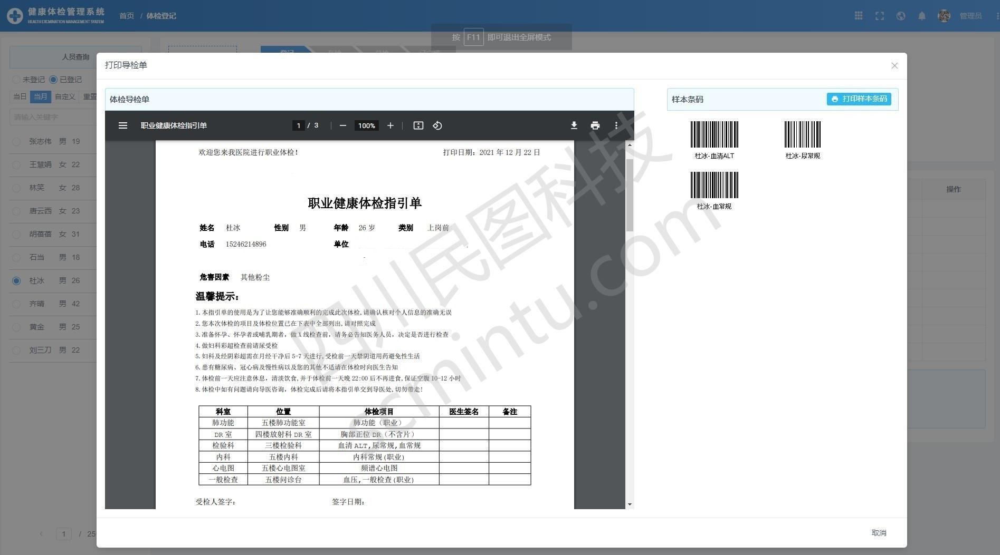
6.体检信息录入以及单项报告预览
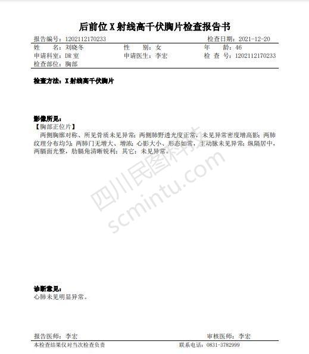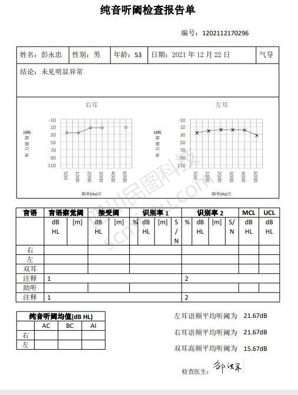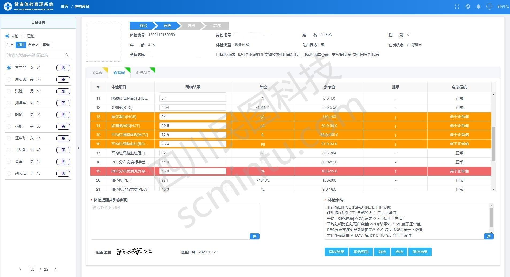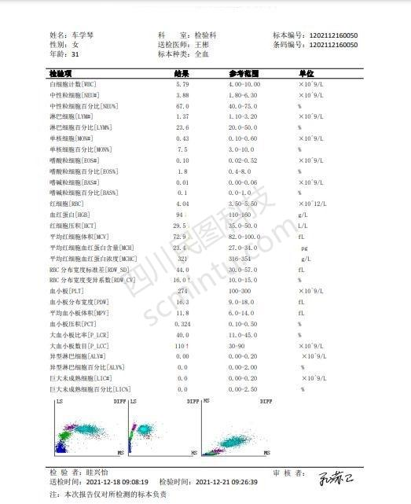
7、医生总检

7.1、个体报告

8、单位报告
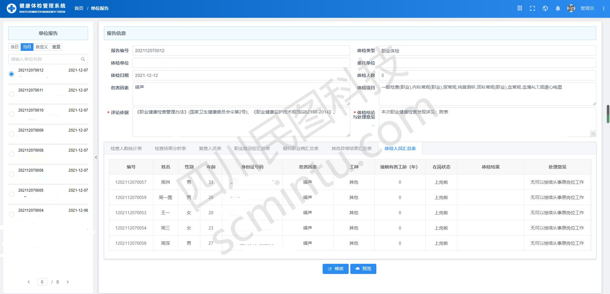
9、基础数据维护
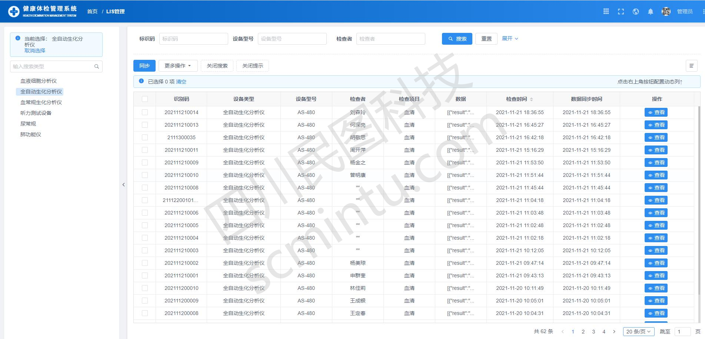
10、数据网报

### 群众微信端
主要是体检预约以及信息查询
1、进入首页,选择体检预约

2、体检机构以及体检类型选择


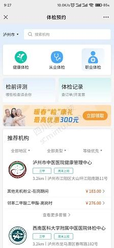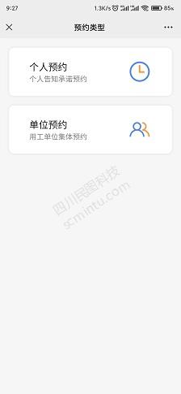

3、体检套餐选择

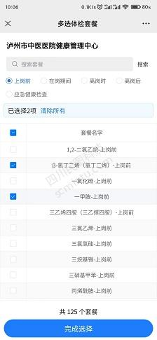

4、体检人员信息录入


5、预约信息查看


6、我的

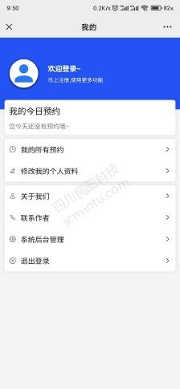

### 自助服务端
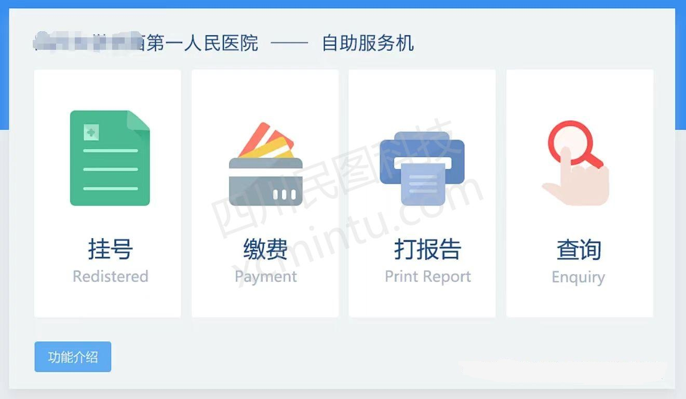
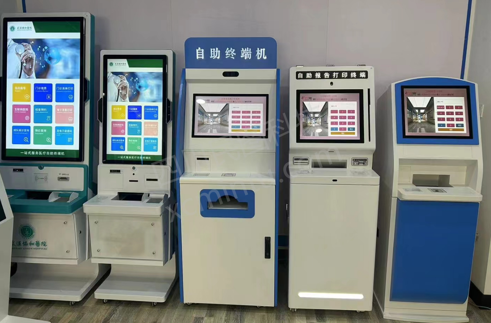
## 🥪开源版使用须知
***
* 需标注"代码来源于四川民图科技开源项目"后即可免费自用运营
* 前端运营时展示的内容不得使用四川民图科技相关信息
* 允许用于个人学习、教学案例
* 开源版不得直接倒卖源码
* 禁止将本项目的代码和资源进行任何形式的出售，产生的一切任何后果责任由侵权者自负

## 🥪商业合作
***
*  如果你想使用功能更完善的体检系统，请联系电话：400-855-2332 或者 微信 wxid_1uhin30bp6xv12
*  如果您想基于体检系统进行定制开发，我们提供有偿定制服务支持！
*  其他合作模式不限，欢迎来撩！
*  联系我们（商务请联系电话：400-855-2332 或者 微信 wxid_1uhin30bp6xv12）

## 🥪 关于我们
***
* 公司名称：四川民图科技有限公司
* 地址：成都市金牛区北三环路一段221号
* 电话：400-855-2332
* 业务合作：scmtkj@163.com
* 公司主页：https://www.scmintu.com/
## 🥪 交流咨询群
如果需要体验账号以及数据库请加QQ群（536624215）


微信联系方式：微信号 wxid_1uhin30bp6xv12

