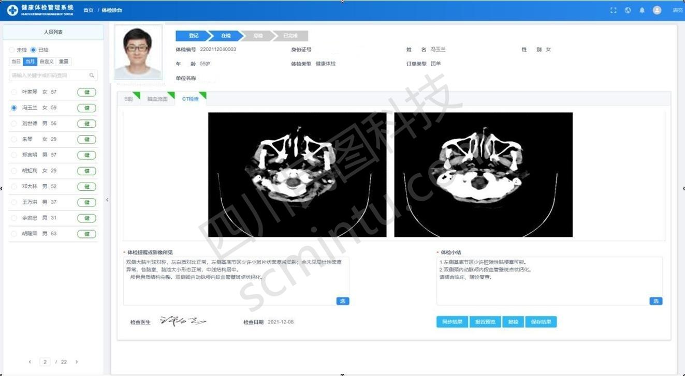
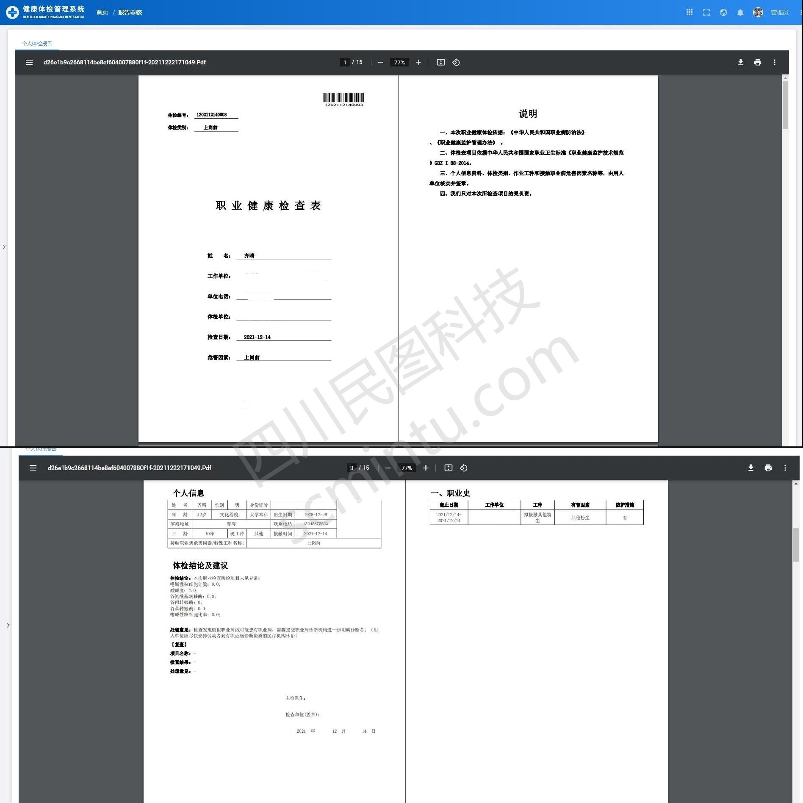
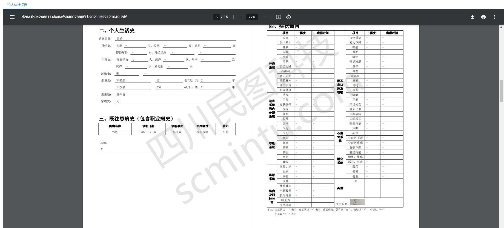
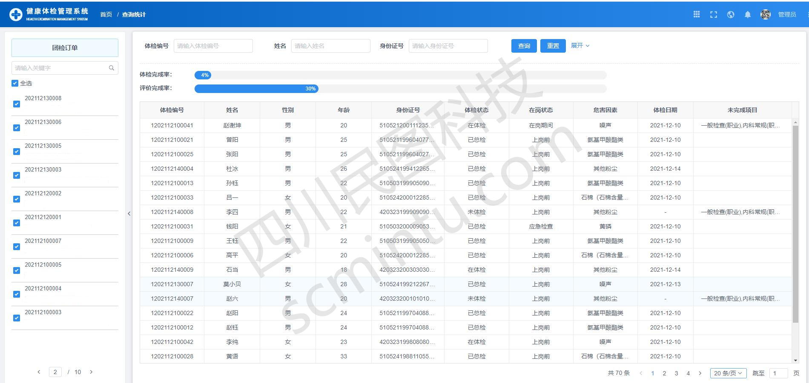

<p align="center">
	<a href="hhttps://223.87.166.240:9123"></a>
</p>
<p align="center">
	<strong>适合互联网企业使用的开源职业体检管理系统</strong>
</p>
<p align="center">
	👉 <a href="https://223.87.166.240:9123">https://scmtww.gnway.cc</a> 👈
</p>

<p align="center">
	<a target="_blank" href="https://spring.io/projects/spring-boot">
		
	</a>
    <a target="_blank" href="https://www.oracle.com/java/technologies/javase/javase-jdk8-downloads.html">
		
	</a>
	<a target="_blank" href="http://www.gnu.org/licenses/lgpl.html">
		
	</a>
</p>


-------------------------------------------------------------------------------

## 📚 项目介绍

healthyCheck是一套适合互联网企业使用的开源体检管理系统，可直接用于健康体检、职业体检、从业体检，适合个体检中心使用，可以对接医院各个设备、LIS、PACS、HIS系统便于数据录入以及出具体检报告，本项目为后端代码工程。

healthyCheck使用`Spring Boot`和`iView Vue`开发，集成`Spring Security`实现权限管理功能，是一套非常实用的web开发框架。

前端工程项目代码：https://gitee.com/scmt1/healthyCheck-ui


## 🍎 项目特点

* 对接了省上职业病体检管理系统，方便网报
* 可以对接各个医疗设备，便于数据录入以及报告整理
* 使用`spring boot`框架作为后端框架，便于维护
* 接口请求和响应数据采用签名机制，保证交易安全可靠
* 管理平台操作界面简洁、易用
* 使用`spring security`实现权限管理
* 前后端分离架构，方便二次开发

## 🍟 项目体验
- 健康体检管理系统：[https://223.87.166.240:9123](https://223.87.166.240:9123 "健康体检管理系统体验")

## 🥞 系统架构

> 健康体检管理系统架构图


> 健康体检管理系统流程图

 


> 核心技术栈

| 软件名称  | 描述 | 版本
|---|---|---
|Jdk | Java环境 | 1.8
|Spring Boot | 开发框架 | 2.4.5
|Redis | 分布式缓存 | 3.2.8 或 高版本
|MySQL | 数据库 | 5.7.X 或 8.0 高版本
|[Iview Ui](http://iview.talkingdata.com/) | iview Vue框架，前端开发使用 | 4.7.0
|[MyBatis-Plus](https://mp.baomidou.com/) | MyBatis增强工具 | 3.4.2
|[Hutool](https://www.hutool.cn/) | Java工具类库 | 5.6.6

> 项目结构

```lua
backend-ui  -- https://gitee.com/scmt1/backend-ui.git

backend
├── scmt-admin -- 公共配置 启动项目包
└── scmt-core -- 公共工具包
├── scmt-modules -- 核心依赖包
     ├── scmt-activiti -- activiti组件
     └── scmt-base -- 父组件
     ├── scmt-generatori -- 代码生成组件
     └── scmt-license -- 授权组件     
     ├── scmt-yw -- 业务代码组件
└── vx_images -- 项目截图
```


## 🍿 功能模块

> 健康体检管理系统功能


## 🍯 系统截图

`以下截图是从实际已完成功能界面截取,截图时间为：2022-07-06 08:59`


## 🥪 关于我们
***
* 公司名称：四川民图科技有限公司
* 地址：成都市金牛区北三环路一段221号
* 电话：0830-2663368
* 业务 QQ：1544857622
* 业务合作：scmtkj@163.com
* 微信：dj18428385268


